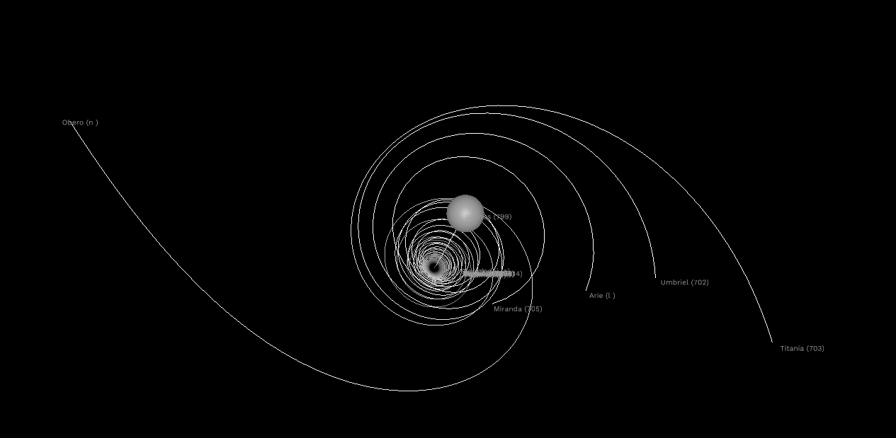

# A Solar System Simulation
This is a simple execution of our solar system using data pulled from JPL's HORIZONS cgi interface. There is little interaction with the simulation other than simple camera controls. The program begins by trying to find a file to load but will attempt to contact HORIZONS if not found and rebuild the file, saving for later use. Then the window will open and run a simple graphical rendering of the objects, drawing a trail of about 40 days of positions behind them.

Uranus and some of it's moons.
## Camera Controls
The camera is an ArcBall mainly controlled by mouse movements: left-click rotates around the focal point, right-click moves the focal point, scroll-wheel changes the distance from the focal point. The camera can also be focused on a moving body but is not set to follow anything by default. The first 10 objects are mapped to the number keys, where 0 is the first object, generally the star. The focus can also be change by using the minus and equal keys and backspace removes the focus from the camera. Be mindful right-click focal point movement does not work when following a body as the camera updates its focal point to the body's position every render pass.
## Optional Arguments
The program also has some optional arguments to call to show case some of the tools. Systems can be built, saved, and loaded. All three can be used at once, although fetching will take precedent over loading a file.
### Load
To load a previously saved system, or one you made yourself, use the following:

    solar_system_simulation.exe -L <file_path>
An example would look like:

    solar_system_simulation.exe -L saves/a_fistful_of_satellites_1969_07_16.json
### Save
To have the program save the system when you close the window, use the following:

    solar_system_simulation.exe -S <file_path>
An example would look like:

    solar_system_simulation.exe -S my_save.json
### Fetch
To build a solar system from HORIZONS, you have to pass a number of arguments including the start date; the number of objects to look up; and a list of objects, separated by spaces. The date requires 4 digits for years and 2 digits for month and days, so pad with zeros! The arguments should look like:

    solar_system_simulation.exe -F <yyyy>-<mm>-<dd> <number_of_targets> <first_target> <second_target>...
An example to build a system with just the sun and planets would be:

    solar_system_simulation.exe -F 1969-07-16 10 10 199 299 399 499 599 699 799 899 999